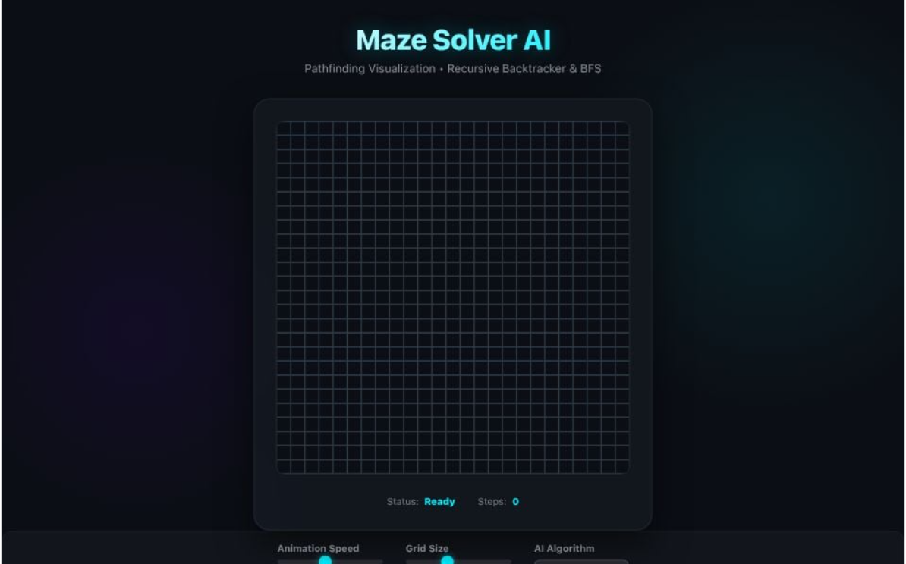

# Maze Solver AI

A fully interactive 3D-style pathfinding visualizer that generates mazes and solves them using popular AI algorithms. Built with vanilla JavaScript and HTML5 Canvas.

## 🛠️ Technology Stack

- **Core**: HTML5, CSS3, JavaScript (ES6+)
- **Rendering**: HTML5 Canvas API (2D Context)
- **Styling**: Vanilla CSS (Responsive, Dark Theme)
- **Icons**: SVG (Feather Icons style)
- **Font**: Inter (Google Fonts)

## 🚀 Features

- **Maze Generation**: Visualized Recursive Backtracker algorithm.
- **Pathfinding**: 
  - **BFS (Breadth-First Search)**: Classic unweighted shortest path algorithm.
  - **A* (A-Star)**: Heuristic-based smart pathfinding.
- **Interactive Controls**:
  - Adjustable Animation Speed (Slow to Instant).
  - Adjustable Grid Size (10x10 to 50x50).
  - Real-time step counter.
  - Responsive design that fits any screen size.

---

## 🧠 Algorithms Explained

### 1. Maze Generation: Recursive Backtracker

The maze is generated using the **Recursive Backtracker** algorithm, which creates "perfect mazes" (mazes with no loops and exactly one path between any two cells).

**How it works:**
1.  **Start**: Pick a starting cell (top-left) and mark it as visited.
2.  **Explore**: Look for a random unvisited neighbor.
3.  **Move**: If an unvisited neighbor exists:
    -   Push the current cell to a stack.
    -   Remove the wall between the current cell and the neighbor.
    -   Make the neighbor the new current cell and mark it visited.
4.  **Backtrack**: If there are *no* unvisited neighbors:
    -   Pop a cell from the stack and make it the current cell.
5.  **Repeat**: Continue until the stack is empty (back at the start).

This is essentially a **Depth-First Search (DFS)** that carves passages as it goes deeper and backtracks when stuck.

---

### 2. Solving Algorithms

This project implements two distinct methods for solving the maze. Any generated maze is solvable, but the *way* the AI finds the path differs significantly.

#### Method A: Breadth-First Search (BFS)
> *"The thorough explorer"*

BFS is a fundamental graph traversal algorithm. It explores the maze layer by layer, like a ripple expanding in a pond.

-   **Mechanism**: It checks all neighbors of the start node, then all neighbors of those neighbors, and so on.
-   **Data Structure**: Uses a **Queue** (First-In-First-Out).
-   **Guarantee**: **Always guarantees the shortest path** in an unweighted grid like this maze.
-   **Visual Behavior**: You will see it expand fairly evenly in all directions (a "flood fill") until it hits the end.
-   **Performance**: Since it is "blind" (doesn't know where the end is), it often dutifully explores dead ends purely because they are close to the start.

#### Method B: A* Search Algorithm (A-Star)
> *"The smart navigator"*

A* is widely considered the best pathfinding algorithm for games and grids. It is an informed search algorithm, meaning it uses a "heuristic" (guess) to guide its search.

-   **Mechanism**: It prioritizes exploring cells that appear to be closer to the goal. It calculates a score `f(n) = g(n) + h(n)` for each cell:
    -   `g(n)`: The actual cost/distance from the start.
    -   `h(n)`: The estimated distance to the goal (Heuristic).
-   **Heuristic Used**: **Manhattan Distance** (`|x1 - x2| + |y1 - y2|`), which is efficient for grid-based movement (up/down/left/right).
-   **Data Structure**: Uses a **Priority Queue** (nodes with lower `f` costs are processed first).
-   **Guarantee**: Also **guarantees the shortest path** (provided the heuristic is "admissible", i.e., it never overestimates the distance).
-   **Visual Behavior**: You will see it "beeline" or stretch towards the target. It ignores directions clearly leading away from the goal unless it gets blocked.

---

## ⚡ Comparison: Which is better?

| Feature | BFS (Breadth-First Search) | A* (A-Star) |
| :--- | :--- | :--- |
| **Strategy** | Explores everywhere equally (Flood Fill). | Beelines towards the target. |
| **Speed (Time)** | **Slower**. It visits far more cells (nodes) before finding the target. | **Faster**. It visits significantly fewer cells because it is directed. |
| **Shortest Path?** | Yes, always. | Yes, always (in this implementation). |
| **Complexity** | Simple logic (Queue). | More complex (Priority Queue + Heuristic). |
| **Best For** | Situations where the target location is unknown or close by. | Situations where the target location is known (like GPS or Games). |

**Summary**: 
- If you want to see the AI struggle and explore every corner, use **BFS**.
- If you want to see the AI intelligently find the route quickly, use **A***.

---

## 💻 How to Run

1.  **Clone** or **Download** the repository.
2.  Open the `index.html` file in any modern web browser.
3.  Click **Generate Maze** to build a map.
4.  Select your algorithm (BFS or A*) and click **Solve**.

_No installation or server is required for this simulation._